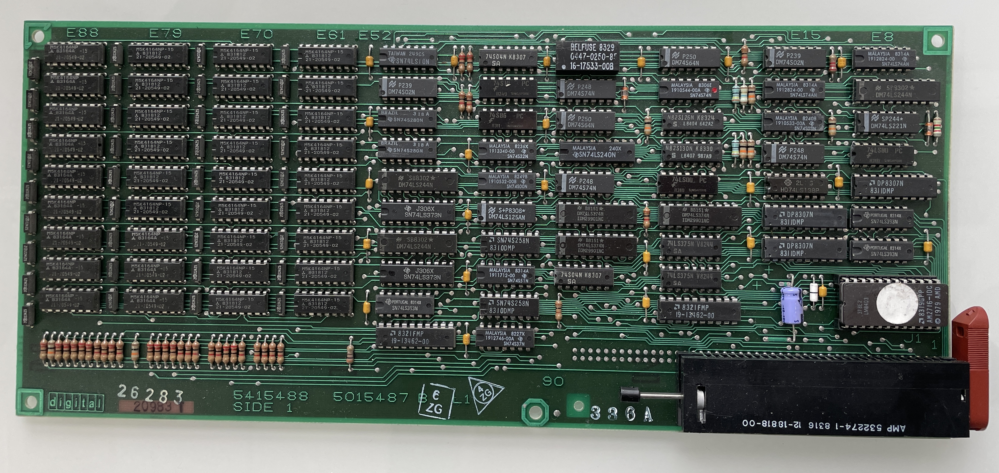

# DECPROMEM

This project aims at creating a modern memory board for the 1985 vintage DEC Professional series of computers with CTI bus. The idea is to use SRAM technology and programmable logic to implement all the random logic needed. The diagnostic ROM that all CTI bus boards need to have is implemented in a SPI EEPROM chip. The programmable logic choosen for this project is the Atmel / Microchip ATF1508 since it is the only contemprary chip that is 5V. I will be using one or two 1Mx16 SRAM chip wich also are 5V. A small SPI EEPROM will contain the diag software. There will not be any parity on board whihc means that the diag software need to be changed compared to the original so that it doesn't test the parity generating and checking circuits on board.

The idea with this project is also to learn a bit about the CTI bus so that I can take on the DECNA-replica project later on which aims at creating a modern replacement for the DECNA board whihc is nearly impossible to find. This will also be using a ATF1508 CPLD.

