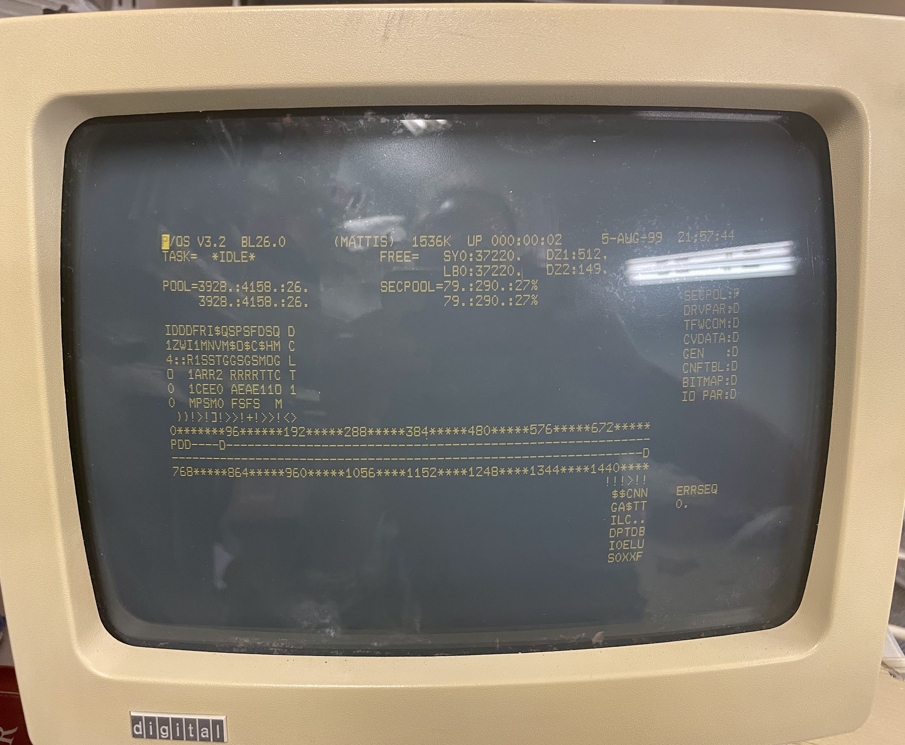
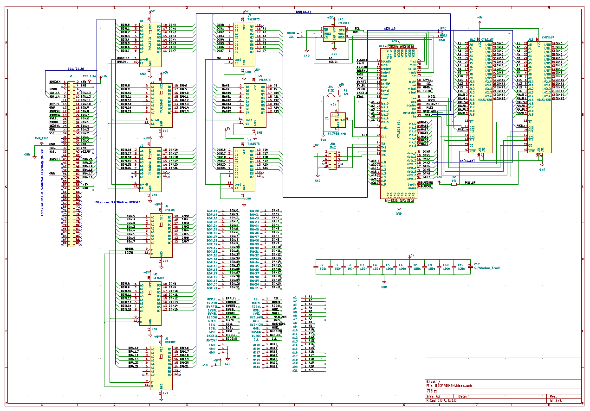
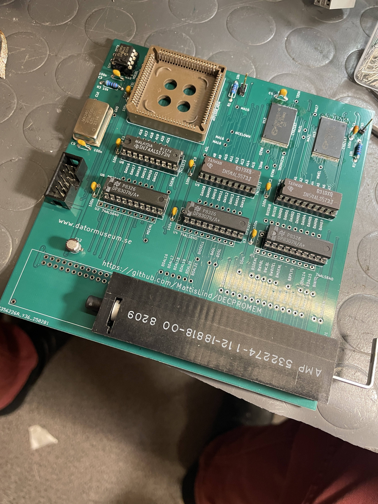
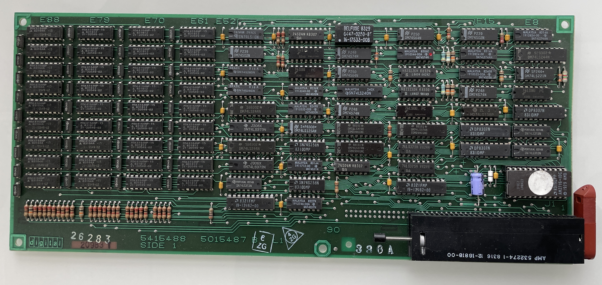

# DECPROMEM

Project finished (almost) and deemed working as intended.

My 1 meg machine now shows 1536 kWord, i.e. 3 Mega byte of memory. The Gerbers in the kicad directory is updated. The final JED file to program the AYTF1508 is in the VHDL directory. Programming the board requires the rather expensive ATDH1150USB JTAG device. But supposedely other devices can be used. Check more here on [this page](https://github.com/peterzieba/5Vpld)

The board can be populated with either 1 or 2 chips. One chip will take your machine from 1 meg to the maximum of three meg. If you have less than 1 meg in your base machine a two chip card is better. The SIZE jumper need to be inserted if you only have one chip. 

The board can be populated with either AMD DP8307 bus tranceivers (which are obsolete but can be found online) or 74ALS640 which should be compatible. However not 100 % pincompatible, thus the overlapping layout.

I have not tested the board with one single chip or using 74ALS640 tranceivers (but it has been tested in simulation).

Debugging of the card took some time. Problems found during debugging:

1. The height of the card was 100 mil to high. Had to carefully cut off the card a bit to get it into the card cage. Lessons learned: Always double (triple) check dimensions. The new layout has this fixed.
2. The brand new 20 MHz crystal from Mouser didn't oscillate. While investigating this I found that certain signals of the Microchip 25LC08A SPI EEPROM require a 50 ns setup time. With a 20 MHz that would be on the margin unless the state machine was modified. I used a 14.7456 MHz crystal oscillator that I happened to find in my drawer.
3. SDENL need to be gated with with signals that indicate that the card is selected. Either IO read or memory read. Otherwise it will clash with other drivers on the bus.
4. The schematic had mixed up the MCELOW, NMCEHIGH and MLE signals. The good thibng it was easy to reroute those signals in the CPLD.
5. The BRPLYL signal was not developed internally. The OC signal was created by setting the signal to either 0 or Z. Somehow Yosys optimzed this away unless I set an attribute on those signal.
6. The BIOSEL signal has to be latched as an address signal. But since the SSxL signal is basically created with the latched BIOSEL on the motherboard there is no point in using BIOSEL anyway. Removed it from the CPLD VHLD logic.
7. The test bench for the SPI ROM wasn't perfect. It mismatched a bit from how reality worked so the SPI communication didn't work properly. The counter has to be incremented on falling edge instead of rising edge. Lessons learned is that good testbed is crucial. Still need to fix that SPIROM test device which still do the wrong thing.
8. When testing it read random number of bytes from the SPI ROM. Sometimes 30 sometimes 50. A metastability issues caused the HOLDL signal to get stuck. Syncing the readPort0 signal on the rising edge solved the problem.
9. The memoryAccess signal generated was spuriously active. Lilkely to be an effect of the fact that it is developed by a long chain of logic which ripples through. By syncing the memoryAccess signal with the clock and gating the clock to with the ASL signal solved the problem. Also making sure that all variables used in the process is the same length.

The development board with a lot of test points.

The original board:

This project aims at creating a modern memory board for the 1985 vintage DEC Professional series of computers with CTI bus. The idea is to use SRAM technology and programmable logic to implement all the random logic needed. The diagnostic ROM that all CTI bus boards need to have is implemented in a SPI EEPROM chip. The programmable logic choosen for this project is the Atmel / Microchip ATF1508 since it is the only contemporary chip that is 5V. I will be using one or two 1Mx16 SRAM chip which also are 5V. A small SPI EEPROM will contain the diag software. There will not be any parity on board whihc means that the diag software need to be changed compared to the original so that it doesn't test the parity generating and checking circuits on board.

The idea with this project is also to learn a bit about the CTI bus so that I can take on the DECNA-replica project later on which aims at creating a modern replacement for the DECNA board whihc is nearly impossible to find. This will also be using a ATF1508 CPLD.

## Firmware

The original diagnostic firmware is stored in either a 2716 or 2732 (jumper selectable on the board according to the manual), but only the lower 1k byte is actually used. 

I have been using xhomer project which I modified to create an execution trace. Thereby I could figure out how the Professional is dealing with CTI bus boards.
All boards has a board ID which identify the board. This is a two byte octal number which is also printed on the board handle. The memory board is 34 for example. Most likely the board id has significance to how the board is handled but I have obnly researched the memory board this far.

All CTI bus boards have a writeable register located at base address + 2 which resets the pointer to the ID / diagnostic ROM when written to it. Then reads from the base address will return byte by byte from the ID / diag ROM. The process is the following:

1. Read the two ID bytes. Decide how to handle board.
2. Reset pointer and read the first 12 bytes into memory. Byte 2 is compared with 0377. I am not sure what happens if it is not matching. Then it uses byte 6 to indicate the number of 128 word blocks that are present in the memory.
3. It resets the pointer again and start reading the number indicated byte location 6 above of 128 word blocks and calculates a checksum. More on the checksum algorithm later.
4. It then resets the pointer again and just read and skip the first 12 bytes. Then it reads in the following 14 bytes.
5. Location 23 and 24 is the size of the actual program code following, where byte 23 is the low byte and 24 is the high byte. The resuling 16 bit integer is then used when reading in the program code.
6. While reading the program code the same type of checksum is calculated again over this smaller block.

### Checksum algorithm

The checksum algorithm is a combination of xor and shift operations.
1. A checksum accumulator is initiated to 0177777
2. Two bytes are read in to form a word.
3. The data is xor:ed with the accumulator contents.
4. The accumulator is shifted on step to the left.
5. The bit overflowing 16 bits is creating a carry bit which either one or zero.
6. The carry bit is added to the accumulator.
7. The process repeats at 2 until all words has been read.
8. If the result in the accumulator is zero when all words has vbeen read then we have a good checksum.

### Firmware functions

The firmware is used to initialize and test the board. The process is the following:
1. Calculates the size of the board. There are two jumpers on the board which give the actual size of the board. I think actually this calculation is buggy for boards with 256 k chips!
2. It compares the calculated size with the value used as base value for this memory array. If the base address indicate that we already configured 3 Megabytes of memory we bail out with an error code.
3. Enable the memory board with the base value given from the system.
4. If memory size of the board give that it will exceed the 3 meg limit it tests so that there is no response from the memory for addresses aboev 3 meg.
5. It now enables the functionaity where  the memory board by design writes the oposite parity value which means that a read will cause a trap, thereby checking so that the parity circuits work.
6. Sets back to normal partity handling and checks the entire array.
7. If everything is ok it reports back the new base value which is essentially the old base value plus the size of this memory array. If something wrong has been detected then it will turn off the memory board and issue a fault code as return value.

### Firmware building

Since I want to change the firmware to not have any parity checking I need to build it using the macro-11 assembler and then compute the two levels of checksums to get a working rom-image to use on the board or in Xhomer. The macro-11 program creates an object file which has to be converted into a raw binary file. This is done using the obj2bin tool.

The Makefile provided should do all the work of doing all this provided that the correct paths to the macro-11 and obj2bin binaries has been given.

