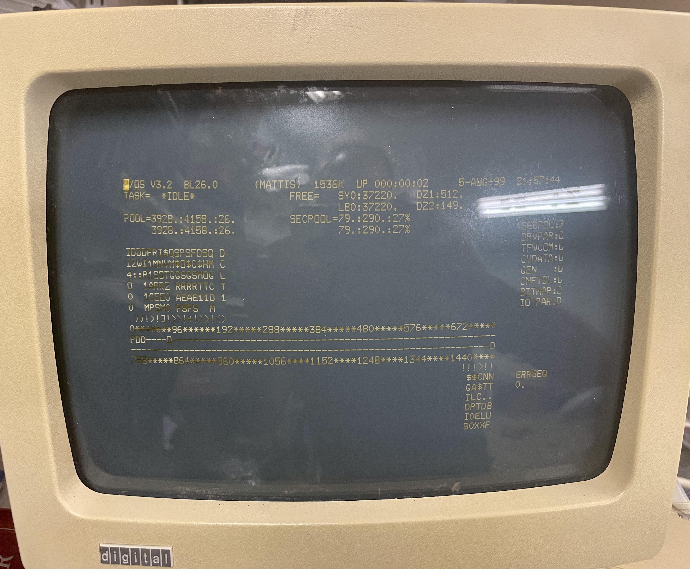

So it is working now. Pro reports 1536 k word of memory. I.e. a total of 3 meg. 1 meg on the mother board and two megs from the expansion card on the bus. There are still some issues remaining. 

The command to build the edif file from vhdl is `atf15xx-yosys-docker/do-ghdl-in-docker.sh ATF1508.vhdl  -o ATF1508` and the command to run the fitter is `./atf15xx-yosys-docker/runfitter-in-docker.sh src/ATF1508`

